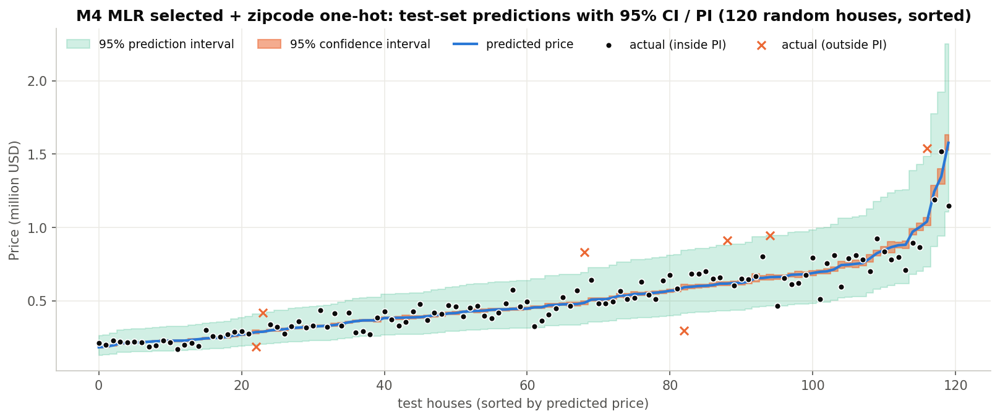
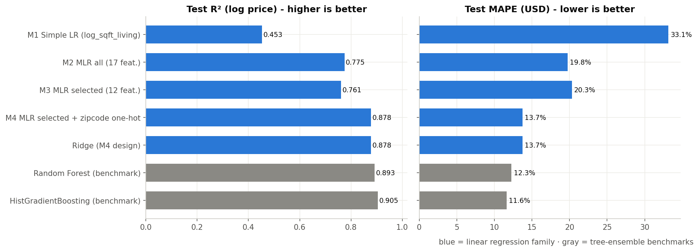

# HW2 — King County House Price Prediction (Multiple Linear Regression, CRISP-DM)

學號 7115064191 ｜ 延伸自 [HW1-CWA-Weather](https://github.com/A0966411725-png/HW1-CWA-Weather)

**Dataset**: [House Sales in King County, USA (Kaggle)](https://www.kaggle.com/datasets/harlfoxem/housesalesprediction) — 21,613 sales, 18 features, target `price`.

## Run
```bash
pip install -r requirements.txt
python3 7115064191_hw2.py      # full CRISP-DM pipeline → figures/, results/, model/
python3 predict.py --sqft_living 2000 --grade 8 --zipcode 98052 --lat 47.68
```

## CRISP-DM
| Phase | What was done |
|---|---|
| Business Understanding | Estimate a fair sale price **with a 95% prediction interval** |
| Data Understanding | 18 features, no missing values, price right-skewed (skew 4.02 → 0.43 after log), collinear area columns |
| Data Preparation | Drop duplicate/invalid rows (21,613 → 21,419), `log(price)`, `house_age`, `is_renovated`, `has_basement`, log areas, zipcode one-hot; 80/20 split |
| Modeling | Feature selection: correlation, VIF, backward elimination (p<0.05), RFECV, LassoCV → **12 features**; models M1–M4 + Ridge/RF/HGB benchmarks |
| Evaluation | R², Adj R², 5-fold CV, RMSE, MAE, MAPE, residual diagnostics, PI coverage |
| Deployment | `model/house_price_mlr.pkl` + `predict.py` (price + 95% CI/PI) |

## Results (test set, 4,284 houses)
| Model | #feat | R² (log) | CV R² | RMSE ($) | MAPE | 95% PI coverage |
|---|---|---|---|---|---|---|
| M1 Simple LR (log sqft_living) | 1 | 0.453 | 0.455 | 296,181 | 33.1% | – |
| M2 MLR all | 17 | 0.775 | 0.772 | 187,262 | 19.8% | – |
| **M3 MLR selected** | 12 | 0.761 | 0.761 | 195,199 | 20.3% | 94.4% |
| **M4 M3 + zipcode one-hot** | 12+69 | **0.878** | 0.879 | 142,491 | 13.7% | 94.0% |
| HistGradientBoosting (benchmark) | 18 | 0.905 | 0.903 | 137,215 | 11.6% | – |

Selected features: `bedrooms, log_sqft_living, log_sqft_lot, floors, waterfront, view, condition, grade, has_basement, house_age, is_renovated, lat`




## Files
- `7115064191_hw2.py` — main program
- `predict.py` — deployment demo
- `7115064191_hw2_report.pdf` / `report.html` — report
- `figures/`, `results/`, `model/` — generated outputs
